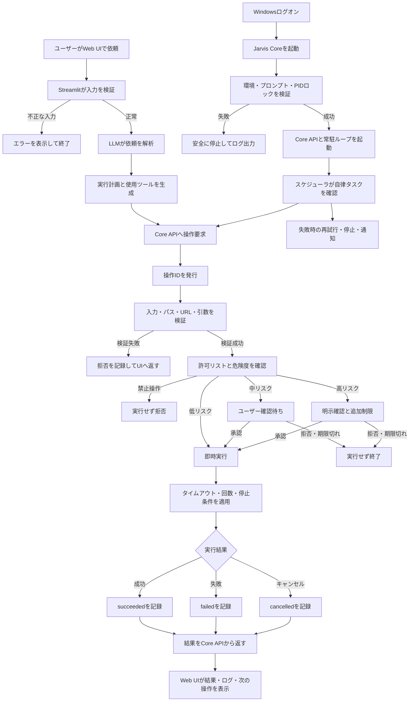

# Jarvis 詳細フローと実装順

## 目的

Jarvisは、Web UIを操作画面として使いながら、Windows上のJarvis Coreが
バックグラウンドで安全にPC操作と自律タスクを実行する構成を目指す。

LLMは直接PCを操作せず、許可されたツールの呼び出し計画だけを作る。
実際の操作はCore側の入力検証、許可リスト、危険度判定、タイムアウト、
ログ記録を通過した場合だけ実行する。

## 詳細な実行フロー



## コンポーネントの責務

| コンポーネント | 責務 |
| --- | --- |
| Streamlit Web UI | チャット、操作依頼、確認、実行状況、ログ表示 |
| LLM | 依頼の解析と許可ツールの選択。PCへ直接アクセスしない |
| Jarvis Core API | 操作受付、検証、危険度判定、状態取得、結果返却 |
| PCツール層 | 許可されたPC操作だけを実行 |
| スケジューラ | 定期実行、自律タスクの開始・停止・再試行 |
| SQLite | 操作状態、実行履歴、メモ、タスク情報の保存 |
| ログ | 操作、承認、拒否、成功、失敗、停止の監査記録 |

## 操作状態

操作は次の状態を持つ。

```text
pending -> running -> succeeded
                   -> failed
                   -> cancelled

pending -> awaiting_confirmation -> running
                                -> cancelled
```

- `pending`: 受付済みだが未実行
- `awaiting_confirmation`: ユーザーの承認待ち
- `running`: 実行中
- `succeeded`: 成功
- `failed`: エラーで終了
- `cancelled`: 拒否、期限切れ、停止要求などで終了

## 実装順

### 1. PC操作基盤（完了）

- ユーザープロファイル配下のディレクトリ一覧
- ユーザープロファイル配下のファイル名検索
- パスの許可範囲チェック
- 検索階層と最大件数の制限
- Core APIからの呼び出し
- HTTP(S) URLのブラウザ許可リスト
- Windows OS通知（`winotify`）

### 2. 実行結果管理の土台（完了の初期版）

- APIレスポンスに操作種別を含める
- `status` と結果を統一形式で返す
- 入力エラーをHTTP 400として返す
- 操作失敗をログに記録する

操作IDとSQLiteの実行履歴まで追加済み。低リスク操作の実行結果も
共通の操作履歴へ保存する。

### 3. 低リスク操作（完了）

- 許可リストにあるアプリの起動
- `http` / `https` URLを既定ブラウザで開く
- 通知要求
- 基本的なシステム情報の取得

現時点では、任意コマンド実行、ファイル削除、外部送信、購入、
メール送信は許可していない。ブラウザは候補サイトの許可リストに
登録されたドメインだけを開き、OS通知はWindowsのトースト通知として表示する。

### 4. 操作ID・実行履歴

- 操作IDの発行
- `pending/running/succeeded/failed/cancelled` の保存
- 開始時刻、終了時刻、実行時間の保存
- 成功結果とエラー内容の保存
- Web UIからの履歴取得

実装済み。SQLiteの`operations`、`confirmations`テーブルと
`/operations`、`/confirmations` APIを使用する。低リスク操作と承認済み操作の
実行結果を操作ID付きで記録する。request hash、承認者の識別は未実装。

### 5. スケジューラと自律タスク

- タスクの作成、停止、再開
- 次回実行時刻の管理
- 最大実行時間と最大ステップ数
- 失敗時の再試行回数
- Core停止時の安全な再開・重複防止

実装済み。`scheduled_tasks`テーブルにタスクを保存し、Coreの
heartbeatごとに期限到来タスクを一度だけ取り出す。操作名と引数を共通の
許可リスト付き実行器へ渡し、実行結果を履歴に保存する。停止・再開・削除API、
最大実行時間、最大ステップ数は未実装。

### 6. ユーザー確認フロー

- 確認要求の発行
- 承認、拒否、期限切れ
- 承認トークン
- 確認内容と実際の引数の一致確認

実装済み。確認要求の作成、承認・拒否、期限切れ、キャンセルをSQLiteで管理する。
承認済み要求はclaim後に共通実行器へ接続し、同じ要求の二重実行を防止する。
承認者の紐付けとrequest hashの監査保存は未実装。

### 7. 安全な変更操作

- ファイル作成、移動、名前変更
- バックアップまたはゴミ箱経由
- 変更前後の記録
- 破壊的操作は明示確認必須

### 8. ブラウザ操作

- 許可されたサイトだけを対象にする
- ページ読み取り
- フォーム入力
- 送信前の確認

投稿、購入、送信、公開は確認なしで実行しない。

### 9. 画面・キーボード・マウス操作

- 対象ウィンドウの限定
- 操作前の画面確認
- 操作失敗時の安全停止
- 緊急停止ボタン

専用APIで実現できない操作に限って導入する。

### 10. 条件分岐付き自律ワークフロー

- 複数ステップ実行
- 条件分岐
- 結果確認
- 失敗時の再試行
- 部分成功からの再開
- 最大時間・最大ステップ数
- 異常時の停止とユーザー通知

## 変更履歴と実装の足跡

この章は、設計時の想定と実装後の実際の状態を区別して記録する。
機能を追加・変更したときは、変更前の制約、変更内容、変更後の状態、
検証結果、残課題を追記する。コードの現在状態だけでなく、なぜその形に
したかも残すことを目的とする。

### 変更前（自律化基盤を追加する前）

- Streamlit UIが主な実行場所で、UIを閉じると自律処理を継続できなかった。
- PC操作、操作履歴、確認要求、スケジュール実行が分離されていなかった。
- スケジューラは存在しても、期限到来タスクを実操作へ安全に接続する境界がなかった。
- 任意コマンド、ファイル変更、ブラウザ入力、送信を許可する仕組みはなかった。
- 実行結果を操作ID単位で追跡する監査記録が不足していた。

### 追加した基盤（変更後）

| 領域 | 追加・変更 | 変更後の状態 |
| --- | --- | --- |
| 常駐 | `jarvis_core.py`、PIDロック、heartbeat | Windowsログオン後もCoreをUIから独立して動かせる |
| PC操作 | `pc_tools.py` | ユーザープロファイル配下、許可アプリ、HTTP(S) URL、システム情報に限定 |
| 操作履歴 | `operations`、`operation_store.py` | 操作ID、状態、結果、エラー、開始/終了を保存 |
| 確認 | `confirmations` | pending、approved、rejected、executing、executed、failed、cancelledを管理 |
| スケジュール | `scheduled_tasks`、`scheduler.py` | 期限到来を原子的に取り出し、許可済み操作だけを実行 |
| 実行境界 | `operation_dispatcher.py` | 操作名と引数を許可リストで検証し、任意コマンドを拒否 |
| ブラウザ境界 | `ALLOWED_BROWSER_SITES` | 許可ドメイン・パス以外のURLを拒否 |
| OS通知 | `winotify` | `queued` 記録だけでなくWindowsトーストを表示 |
| 再試行・停止 | 確認実行APIの上限・キャンセルAPI | 再試行は最大3回、未実行要求はキャンセル可能 |
| DB移行 | `db.init_db()` | 既存DBにスケジュール引数列を起動時追加 |

### 実装前後のフロー差分

#### 変更前

```text
ユーザー入力
  -> UI/API
  -> 操作要求
  -> （スケジューラは期限到来を検出するだけ）
  -> ログ出力
```

#### 変更後

```text
ユーザー入力 / スケジュール
  -> Core API
  -> 操作名・引数・パス・URLを検証
  -> 許可リストと確認状態を確認
  -> 操作IDを発行
  -> 低リスク操作を実行
  -> 成功・失敗・キャンセルと結果をSQLiteへ保存
```

確認が必要な操作は次の経路を通る。

```text
確認要求を作成
  -> pending
  -> ユーザーが承認
  -> 操作内容をclaim（同じ要求は一度だけ）
  -> 実行器へ渡す
  -> succeeded / failed
```

### 現在の実装状態（2026-09-07）

#### 実装済み

- 1. PC操作基盤
  - ユーザープロファイル配下の一覧・検索
  - 許可アプリ起動（メモ帳・電卓）
  - HTTP(S) URLの既定ブラウザ起動
  - 許可サイト内の読み取り専用HTTP取得（最大100KB）
  - 基本システム情報取得
- 2. 実行結果管理
  - 操作ID、状態、結果、エラー、開始/終了時刻
  - `/operations` による履歴取得
- 3. 低リスク操作
  - 共通ディスパッチャによる許可操作の限定実行
  - 不明な操作名、余分な引数、許可外パスを拒否
- 4. 確認フロー
  - 確認要求の作成、承認、拒否、期限切れ
  - 承認済み要求の一度だけのclaim
  - 承認済み操作の実行と履歴保存
  - 実行済み・キャンセル済み要求の再実行防止
- 5. スケジューラ
  - タスクの登録、次回実行時刻、期限到来タスクの取得
  - SQLiteの予約トランザクションによる重複取得防止
  - 許可リスト済み操作のみスケジュール可能
  - 実行時の操作履歴保存
  - タスク停止・再開・削除API
- 6. 実行制御
  - 確認実行の再試行回数を1〜3回に制限
  - 未実行の確認要求をキャンセル
- 7. 安全な変更操作
  - ユーザープロファイル配下に限定したファイル移動
  - 移動前バックアップを必須化
- 10. 条件分岐付き自律ワークフロー
  - 最大5ステップの許可操作ワークフロー
  - 各ステップを共通ディスパッチャで検証

#### 一部実装・追加検証が必要

- Core常駐のタスクスケジューラ登録、再起動、停止復旧は実機検証が必要。
- Windowsアプリ起動、ブラウザ起動、HTTP経由APIは実機での確認を継続する。
- スケジュールタスクの最大実行時間、最大ステップ数、Core停止後の再開ポリシーは未完成。
- 確認内容と実行引数は確認レコードから実行しているが、承認者の識別や
  request hashの監査保存は未追加。

#### 未実装

- 7. ファイル編集・名前変更・削除（移動はバックアップ付きで実装済み）
- 8. ドメイン・パス・操作種別を分けたブラウザのフォーム入力・送信操作
- 9. 対象ウィンドウを限定した画面・キーボード・マウス操作
- 10. 条件分岐、部分成功からの再開、ワークフロー単位のキャンセル
- Geminiの実接続を使った限定的な手動検証

### 検証記録

- 変更前の全体テスト: 191 passed、1 skipped、2 warnings。
- 確認フロー追加後の対象テスト: 5 passed。
- 再試行・キャンセル追加後の対象テスト: 9 passed。
- 最新の全体テスト: **192 passed、1 skipped、2 warnings**。
- ブラウザ許可リストとOS通知追加後の最新テスト: **193 passed、1 skipped、2 warnings**。
- 許可サイトの読み取り専用ブラウザ操作追加後の対象テスト: **22 passed、1 warning**。
- ファイル安全操作・ワークフロー追加後の対象テスト: **21 passed、1 warning**。
- skipped 1件は `test_types.py::TestLlmClientTypes::test_get_gemini_client_returns_client`。
  Gemini APIキーを必要とする外部接続テストのため、通常の全体テストではスキップする。
- warnings 2件はChromaDBとGoogle GenAI SDK内部の将来非推奨APIであり、
  現時点の機能失敗ではない。

### 次の実装順

1. 操作履歴にrequest hash、試行回数、キャンセル理由を追加する。
2. スケジュールタスクの停止・再開・削除と、最大実行時間・停止条件を追加する。
3. Windows OS通知を実装し、成功・失敗・キャンセルを通知する。
4. バックアップ必須のファイル変更を読み取り専用操作とは別の権限階層で実装する。
5. 許可サイト設定と、閲覧・入力・送信の操作権限を分離する。
6. APIキーを表示せず、Gemini実接続テストを1回だけ手動実行する。

### 前段（1〜3）の完了判定

1〜3について、実装上の未完了項目は解消済みとする。
ブラウザは許可リスト外を拒否し、通知は `queued` の記録だけでなく
Windows OS通知の表示まで行う。実機での確認は、Windowsログオン時のCore起動、
ブラウザ表示、通知表示を環境ごとに追加確認する。
これ以降は4（操作ID・実行履歴）の拡張として、監査情報とスケジュール制御を進める。

### 設計上の不変条件

- LLMはPCへ直接アクセスせず、Coreの許可された操作だけを呼び出す。
- 未知の操作、任意コマンド、許可外パスは実行しない。
- 確認が必要な操作は承認されるまで実行しない。
- 同じ確認要求は一度しかclaimできない。
- 再試行回数には上限を設け、無限リトライしない。
- ファイル変更は、バックアップ作成が成功するまで本体を変更しない。
- 送信、投稿、公開、購入、決済、認証情報入力は自動実行しない。

この順序は、PC操作を早く使えるようにしつつ、削除・送信・画面操作など
影響の大きい機能を、確認・停止・監査の仕組みより先に解禁しないためのもの。

## 運用方針（決定事項）

### 常時稼働

Jarvis CoreはWindowsログオン時に起動し、Web UIを閉じても常駐する。
常時実行してよいのは、監視、スケジュール確認、通知、許可済みの低リスク操作だけ。
すべての自律タスクには、最大実行時間、最大ステップ数、再試行回数、
停止条件を設定し、異常時は安全停止して通知する。

### ファイル変更

自律処理では、変更前バックアップを作成した変更だけを許可する。

- 編集・置換: 変更前バックアップを作成してから実行する
- 移動・名前変更: 操作前後のパスを記録する
- 削除: バックアップを作成してから、削除対象とバックアップ先を記録する
- 完全削除: 通常の自律処理では禁止し、将来も別途の明示確認を必須にする

バックアップは元ファイルと同一内容を別名で保存し、対象、変更内容、
バックアップ先をプレビューしてから実行する。バックアップ作成に失敗した場合は
本体を変更しない。

### ブラウザ操作

ブラウザは許可リストに登録されたドメイン・パスだけを対象にする。
ドメインが許可されていても、操作種別ごとに制限する。

| 操作 | 方針 |
| --- | --- |
| 閲覧・検索・情報取得 | 許可サイト内で自動実行可能 |
| フォーム入力 | 入力内容を表示して確認 |
| 下書き保存 | 確認後に実行 |
| メール送信・投稿・公開 | 毎回明示確認 |
| 購入・決済 | 常に明示確認。自動実行しない |
| パスワード・認証情報の入力 | Jarvisでは扱わない |

### 初期許可候補

次のサイトを候補として用意する。ただし、実装時はドメインを登録するだけで
全面的な自動操作を許可せず、サイトごとにパスと操作種別を制限する。

| 分類 | ドメイン候補 | 初期用途 |
| --- | --- | --- |
| 開発 | `github.com`, `gitlab.com`, `stackoverflow.com` | リポジトリ・Issue・技術情報の閲覧 |
| Google | `google.com`, `calendar.google.com`, `docs.google.com`, `drive.google.com` | 検索、予定、文書、ファイルの確認 |
| Microsoft | `microsoft.com`, `outlook.office.com`, `onedrive.live.com` | 製品情報、メール・ファイルの確認 |
| 仕事・文書 | `notion.so`, `slack.com`, `teams.microsoft.com` | ノートや連絡の確認 |
| 情報収集 | `wikipedia.org`, `developer.mozilla.org`, `docs.python.org`, `pypi.org` | 調査・公式ドキュメント確認 |
| 自動化 | `localhost` | ローカル開発サービスの確認 |

初期状態で自動実行を許可するのは、公式情報の閲覧・検索・読み取りまでとする。
フォーム入力、下書き保存、Issue作成、予定変更、メッセージ作成は確認が必要。
メール送信、投稿、公開、購入、決済は毎回明示確認し、パスワード・認証情報の
入力はJarvisでは扱わない。

候補サイトはユーザーの実際の利用状況に合わせて後から追加・削除できるようにし、
許可リストはコードに直書きせず設定として管理する。
