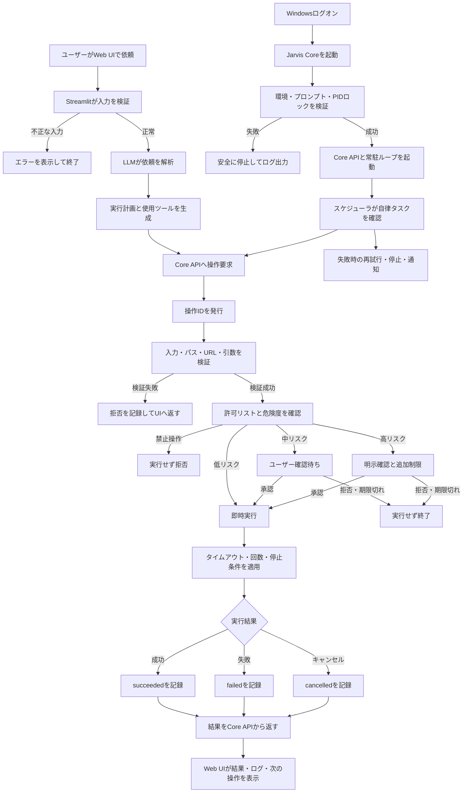

# Jarvis 詳細フローと実装順

## 目的

Jarvisは、Web UIを操作画面として使いながら、Windows上のJarvis Coreが
バックグラウンドで安全にPC操作と自律タスクを実行する構成を目指す。

LLMは直接PCを操作せず、許可されたツールの呼び出し計画だけを作る。
実際の操作はCore側の入力検証、許可リスト、危険度判定、タイムアウト、
ログ記録を通過した場合だけ実行する。

## 詳細な実行フロー



## コンポーネントの責務

| コンポーネント | 責務 |
| --- | --- |
| Streamlit Web UI | チャット、操作依頼、確認、実行状況、ログ表示 |
| LLM | 依頼の解析と許可ツールの選択。PCへ直接アクセスしない |
| Jarvis Core API | 操作受付、検証、危険度判定、状態取得、結果返却 |
| PCツール層 | 許可されたPC操作だけを実行 |
| スケジューラ | 定期実行、自律タスクの開始・停止・再試行 |
| SQLite | 操作状態、実行履歴、メモ、タスク情報の保存 |
| ログ | 操作、承認、拒否、成功、失敗、停止の監査記録 |

## 操作状態

操作は次の状態を持つ。

```text
pending -> running -> succeeded
                   -> failed
                   -> cancelled

pending -> awaiting_confirmation -> running
                                -> cancelled
```

- `pending`: 受付済みだが未実行
- `awaiting_confirmation`: ユーザーの承認待ち
- `running`: 実行中
- `succeeded`: 成功
- `failed`: エラーで終了
- `cancelled`: 拒否、期限切れ、停止要求などで終了

## 実装順

### 1. PC操作基盤（完了）

- ユーザープロファイル配下のディレクトリ一覧
- ユーザープロファイル配下のファイル名検索
- パスの許可範囲チェック
- 検索階層と最大件数の制限
- Core APIからの呼び出し

### 2. 実行結果管理の土台（完了の初期版）

- APIレスポンスに操作種別を含める
- `status` と結果を統一形式で返す
- 入力エラーをHTTP 400として返す
- 操作失敗をログに記録する

次の拡張で操作IDとSQLiteの実行履歴を追加する。

### 3. 低リスク操作（完了）

- 許可リストにあるアプリの起動
- `http` / `https` URLを既定ブラウザで開く
- 通知要求
- 基本的なシステム情報の取得

現時点では、任意コマンド実行、ファイル削除、外部送信、購入、
メール送信は許可していない。

### 4. 操作ID・実行履歴

- 操作IDの発行
- `pending/running/succeeded/failed/cancelled` の保存
- 開始時刻、終了時刻、実行時間の保存
- 成功結果とエラー内容の保存
- Web UIからの履歴取得

### 5. スケジューラと自律タスク

- タスクの作成、停止、再開
- 次回実行時刻の管理
- 最大実行時間と最大ステップ数
- 失敗時の再試行回数
- Core停止時の安全な再開・重複防止

### 6. ユーザー確認フロー

- 確認要求の発行
- 承認、拒否、期限切れ
- 承認トークン
- 確認内容と実際の引数の一致確認

### 7. 安全な変更操作

- ファイル作成、移動、名前変更
- バックアップまたはゴミ箱経由
- 変更前後の記録
- 破壊的操作は明示確認必須

### 8. ブラウザ操作

- 許可されたサイトだけを対象にする
- ページ読み取り
- フォーム入力
- 送信前の確認

投稿、購入、送信、公開は確認なしで実行しない。

### 9. 画面・キーボード・マウス操作

- 対象ウィンドウの限定
- 操作前の画面確認
- 操作失敗時の安全停止
- 緊急停止ボタン

専用APIで実現できない操作に限って導入する。

### 10. 条件分岐付き自律ワークフロー

- 複数ステップ実行
- 条件分岐
- 結果確認
- 失敗時の再試行
- 部分成功からの再開
- 最大時間・最大ステップ数
- 異常時の停止とユーザー通知

## 現在の進捗

- 実装済み: 1〜3
- 次に実装: 4（操作ID・実行履歴）
- 未実装: 5〜10

この順序は、PC操作を早く使えるようにしつつ、削除・送信・画面操作など
影響の大きい機能を、確認・停止・監査の仕組みより先に解禁しないためのもの。
